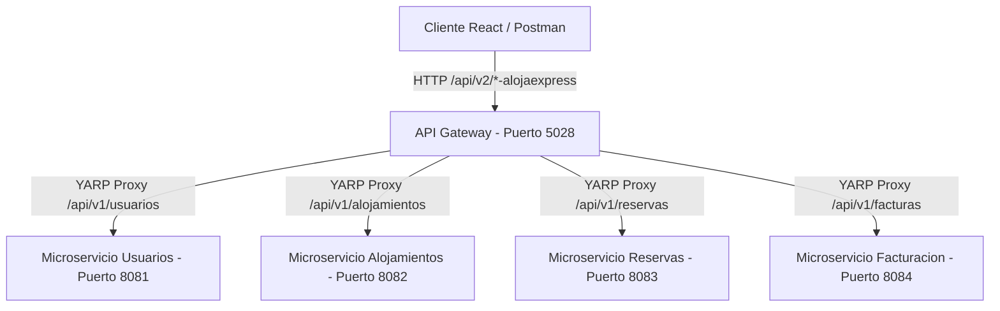

# 🏨 AlojaExpress - Documentación Técnica y Manual de Integración

Este documento detalla la especificación de diseño, arquitectura, contratos de API, base de datos e integración para la plataforma **AlojaExpress**.

---

## 1. Visión General del Sistema

El sistema implementa una arquitectura orientada a microservicios con una puerta de enlace de API (API Gateway) central, bases de datos independientes por servicio, y un frontend SPA reactivo en React + Vite.

### Stack Tecnológico

| Capa | Tecnología | Descripción |
| :--- | :--- | :--- |
| **Bases de Datos** | PostgreSQL (Supabase) | Una base de datos independiente y aislada por microservicio. |
| **Backend** | .NET 8 (ASP.NET Core / C#) | 4 Microservicios (Alojamientos, Usuarios, Reservas, Facturación) + 1 API Gateway. |
| **API Gateway** | YARP (Yet Another Reverse Proxy) | Enrutador reverso con agregaciones personalizadas y compensaciones distribuidas. |
| **Frontend Web** | React + Vite + Zustand | SPA reactiva con un diseño moderno, transiciones dinámicas y microanimaciones. |
| **Contrato de API** | OpenAPI 3.0 (Swagger) | Especificación del contrato `/api/v2/{recurso}-alojaexpress` para flujos externos. |

---

## 2. Arquitectura de Microservicios y Rutas del Gateway

Para garantizar la modularidad y escalabilidad, el sistema se divide en cuatro microservicios de dominio que escuchan en puertos internos y se comunican a través de un API Gateway centralizado en el puerto `5028`.



### Mapeos de Rutas Unificadas (YARP)

El Gateway expone endpoints unificados bajo la convención `/api/v2/{recurso}-alojaexpress` y los traduce hacia los endpoints internos `/api/v1/{recurso}` de cada microservicio:

| Endpoint Público (Gateway) | Endpoint Interno (Microservicio) | Servicio Destino |
| :--- | :--- | :--- |
| `/api/v2/auth-alojaexpress/{**remainder}` | `/api/v1/auth/{**remainder}` | `Usuarios.API` |
| `/api/v2/clientes-alojaexpress/{**remainder}` | `/api/v1/clientes/{**remainder}` | `Usuarios.API` |
| `/api/v2/usuarios-alojaexpress/{**remainder}` | `/api/v1/usuarios/{**remainder}` | `Usuarios.API` |
| `/api/v2/alojamientos-alojaexpress/{**remainder}` | `/api/v1/alojamientos/{**remainder}` | `Alojamientos.API` |
| `/api/v2/habitaciones-alojaexpress/{**remainder}` | `/api/v1/habitaciones/{**remainder}` | `Alojamientos.API` |
| `/api/v2/fotos-alojaexpress/{**remainder}` | `/api/v1/fotos/{**remainder}` | `Alojamientos.API` |
| `/api/v2/calendario-alojaexpress/{**remainder}` | `/api/v1/calendario/{**remainder}` | `Alojamientos.API` |
| `/api/v2/reservas-alojaexpress/{**remainder}` | `/api/v1/reservas/{**remainder}` | `Reservas.API` |
| `/api/v2/facturas-alojaexpress/{**remainder}` | `/api/v1/facturas/{**remainder}` | `Facturacion.API` |
| `/api/v2/metodospago-alojaexpress/{**remainder}` | `/api/v1/metodospago/{**remainder}` | `Facturacion.API` |

---

## 3. Lógica Especial y Transacciones Compensatorias

El API Gateway no se limita a reenviar peticiones (reverse proxy), sino que orquesta procesos de negocio complejos y de autorización:

### 1. Creación de Reserva Coherente (Calendario + Reserva)
Cuando el cliente realiza un `POST /api/v2/reservas-alojaexpress`, el API Gateway orquesta los siguientes pasos:
1. **Comprobar disponibilidad** en `Alojamientos.API`.
2. **Crear la reserva** en `Reservas.API` con estado `Pendiente`.
3. **Bloquear fechas** del calendario en `Alojamientos.API`.
4. **Si el microservicio de Reservas falla**, se dispara una **acción de compensación** que libera inmediatamente el calendario en `Alojamientos.API` para evitar inconsistencias en el inventario.

### 2. Cancelación de Reserva y Compensación
Cuando se ejecuta `PATCH /api/v2/reservas-alojaexpress/{id}/cancelar` o se actualiza a estado `Cancelada`:
1. El Gateway actualiza el estado a `Cancelada` en `Reservas.API`.
2. Llama inmediatamente a `Alojamientos.API` para **liberar las fechas** en el calendario de disponibilidad.

### 3. Checkout Seguro con Idempotencia
El endpoint `POST /api/v2/reservas-alojaexpress/checkout` interceptado por el middleware en el Gateway realiza la facturación atómica:
1. Valida el código de reserva.
2. Calcula el monto exacto multiplicando el número de noches por el costo de habitación.
3. Invoca a `Facturacion.API` con un encabezado `Idempotency-Key` para evitar transacciones duplicadas por doble-clic del usuario.
4. Cambia el estado de la reserva a `Confirmada` en `Reservas.API`.

---

## 4. Frontend Client Architecture (React)

El frontend está refactorizado con una arquitectura limpia basada en módulos API aislados en `src/api` y configurados sobre un cliente Axios común en `src/api/client.js`:

```javascript
// client.js
const BASE_URL = import.meta.env.VITE_API_BASE_URL || '/api/v2';
const client = axios.create({ baseURL: BASE_URL, timeout: 15000 });
```

### Módulos del Frontend API

- [alojamientosApi](file:///c:/Users/Torres/Sistema%20Alojamiento%20RDA3/booking-frontend/src/api/alojamientos.api.js): Búsqueda, ciudades, tipos de alojamiento y galería de fotos de propiedades.
- [habitacionesApi](file:///c:/Users/Torres/Sistema%20Alojamiento%20RDA3/booking-frontend/src/api/habitaciones.api.js): Habitaciones de hoteles y verificación de disponibilidad por fechas.
- [authApi](file:///c:/Users/Torres/Sistema%20Alojamiento%20RDA3/booking-frontend/src/api/auth.api.js): Login, listar usuarios, cambiar rol y estado (bloqueo).
- [clientesApi](file:///c:/Users/Torres/Sistema%20Alojamiento%20RDA3/booking-frontend/src/api/clientes.api.js): Registrar huéspedes y obtener perfiles.
- [reservasApi](file:///c:/Users/Torres/Sistema%20Alojamiento%20RDA3/booking-frontend/src/api/reservas.api.js): Crear reservas, historial, cancelación y checkout.
- [facturasApi](file:///c:/Users/Torres/Sistema%20Alojamiento%20RDA3/booking-frontend/src/api/facturas.api.js): Consultar facturación por reserva.
- [calendarioApi](file:///c:/Users/Torres/Sistema%20Alojamiento%20RDA3/booking-frontend/src/api/calendario.api.js): Consultar disponibilidad ocupacional mensual y bloqueo administrativo.

---

## 5. Diseño e Integración de la Base de Datos

Cada microservicio gestiona su propio esquema relacional en PostgreSQL:

### Esquema Alojamientos
- **Alojamientos**: `AlojamientoId`, `SocioId` (ref. lógica), `TipoAlojamientoId`, `Ciudad`, `Nombre`, `Direccion`, `Estrellas`, `Estado`.
- **Habitaciones**: `HabitacionId`, `AlojamientoId`, `Nombre`, `PrecioNoche`, `CapacidadAdultos`, `CapacidadNinos`, `Estado`.
- **CalendarioDisponibilidad**: `CalendarioId`, `HabitacionId`, `Fecha`, `Estado` (Disponible, Ocupado, Bloqueado).

### Esquema Usuarios
- **Usuarios**: `UsuarioId`, `Email`, `PasswordHash`, `NombreCompleto`, `RolId`, `Estado` (Activo/Inactivo).
- **Clientes**: `ClienteId`, `UsuarioId`, `Cedula`, `Telefono`, `Domicilio`.
- **Colaboradores**: `ColaboradorId`, `UsuarioId`, `NombreEmpresa`, `Telefono`.

### Esquema Reservas
- **Reservas**: `ReservaId`, `CodigoReserva`, `ClienteId`, `AlojamientoId`, `FechaCheckIn`, `FechaCheckOut`, `Total`, `Estado`.
- **ReservaDetalles**: `DetalleId`, `ReservaId`, `HabitacionId`, `PrecioPorNoche`, `NumNoches`.

### Esquema Facturación
- **Facturas**: `FacturaId`, `ReservaId`, `Monto`, `MetodoPagoId`, `Estado`, `FechaPago`.
- **MetodosPago**: `MetodoPagoId`, `Nombre` (Tarjetas, En Sitio), `IdentificadorExterno`.

---

## 6. Pruebas y Validación (QA)

Para verificar y probar la integración completa del sistema de forma local:

1. Importar la colección de Postman [Proyecto_Postman_Collection.json](file:///c:/Users/Torres/Sistema%20Alojamiento%20RDA3/Proyecto_Postman_Collection.json).
2. Configurar la variable `baseUrl` a `http://localhost:5028`.
3. Ejecutar la llamada **Iniciar Sesión (Login)** para capturar el token JWT de forma dinámica.
4. Probar las peticiones de consulta y reservas.
5. Ejecutar `npm run build` en el directorio `booking-frontend` para asegurar que todo compila limpiamente.
